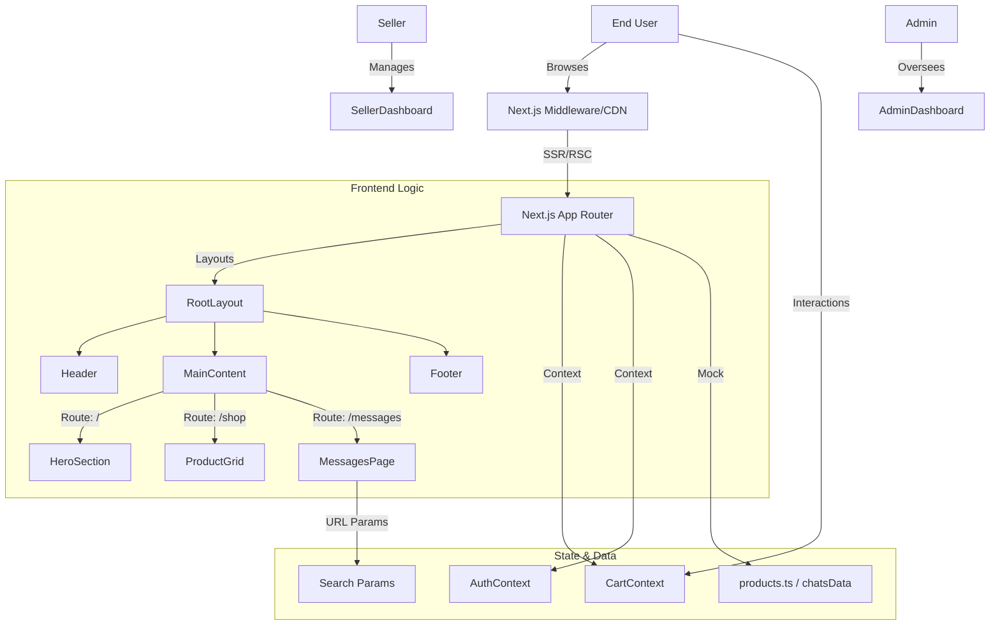
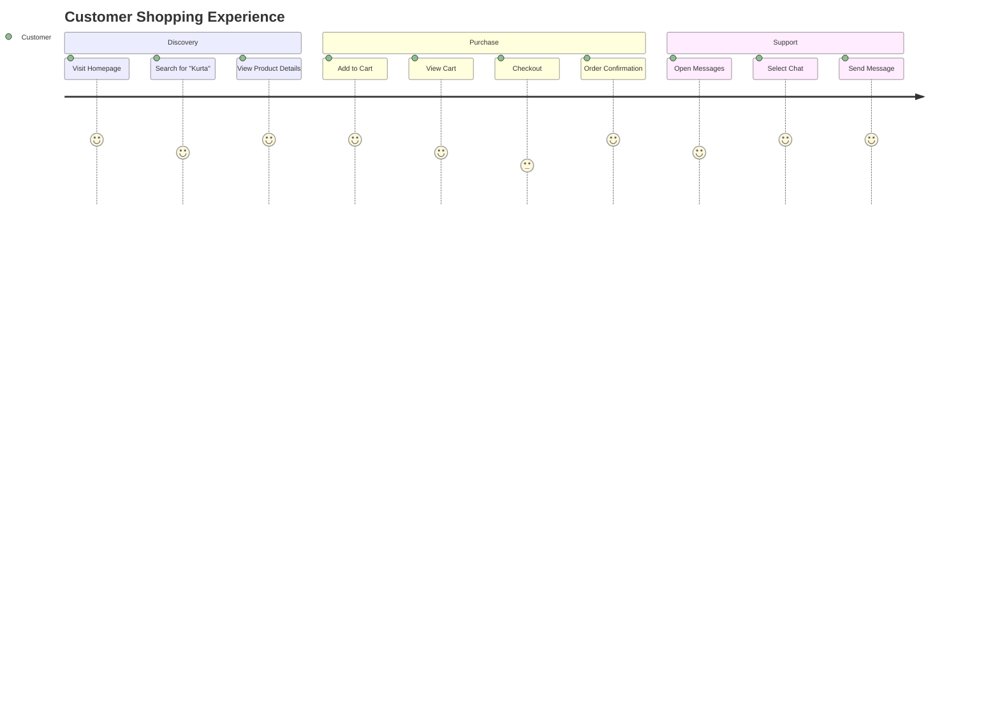
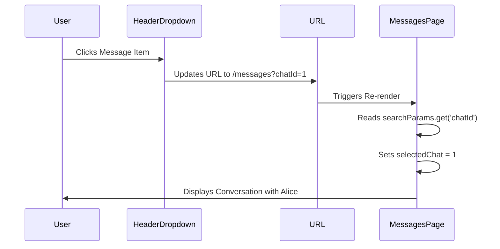
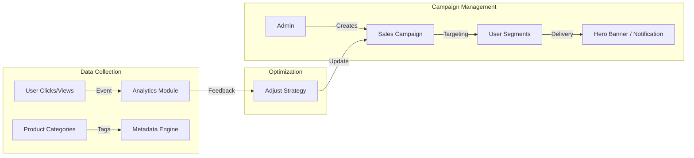

# Mega Mall - Premier Fashion Marketplace


Mega Mall is a modern, high-performance e-commerce marketplace connecting fashion enthusiasts with top brands. Built with **Next.js 13+ (App Router)**, **Tailwind CSS**, and **TypeScript**, it offers a seamless shopping experience with features like Real-time Chat, Admin Dashboards, and Seller Portals.

## 🚀 Features

-   **🛍️ Customer Marketplace**
    -   Dynamic Home Page with Hero Slider.
    -   Advanced Search with Synonyms & Categorization.
    -   Real-time Cart & Checkout.
    -   User Profiles & Order History.
    -   **Deep Linking Chat**: Direct messaging with sellers.

-   **🏢 Admin Dashboard**
    -   Comprehensive Analytics & Reporting.
    -   User & Brand Management.
    -   Platform Settings.
    -   Dark Mode Support.

-   **🏪 Seller Portal**
    -   Inventory Management.
    -   Order Processing.
    -   Direct Customer Messaging.
    -   Sales Performance Metrics.

## 🛠️ Tech Stack

-   **Framework**: [Next.js 14](https://nextjs.org/) (App Router)
-   **Styling**: [Tailwind CSS](https://tailwindcss.com/) + Framer Motion
-   **Language**: TypeScript
-   **State Management**: React Context API
-   **Icons**: Heroicons & Lucide React
-   **Optimization**: `next/image`, `next/font`, Dynamic Imports

## 📊 System Architecture



## 🔄 User Journey Flow



## 💬 Chat System Logic (Deep Linking)



## 📁 Project Structure

```bash
src/
├── app/                 # App Router Pages & Layouts
│   ├── (auth)/          # Auth Group (Login/Signup)
│   ├── admin/           # Admin Dashboard Routes
│   ├── messages/        # Messaging System
│   ├── product/         # Product Details
│   └── page.tsx         # Home Page
├── components/          # Reusable Components
│   ├── layout/          # Header, Footer
│   ├── home/            # Hero, Categories, Featured
│   ├── product/         # ProductCard, Reviews
│   └── ui/              # Buttons, Inputs, Modals
├── contexts/            # Global State (Auth, Cart)
└── lib/                 # Utilities & Helpers
```

## 📈 Marketing & Analytics Engine



## 🚀 Getting Started

1.  **Clone the repository**:
    ```bash
    git clone https://github.com/Ahmad-Abudllah-Ahmad/baddies-essentials.git
    cd baddies-essentials
    ```

2.  **Install dependencies**:
    ```bash
    npm install
    ```

3.  **Run the development server**:
    ```bash
    npm run dev
    ```

4.  Open [https://baddies-essentials.vercel.app/](https://baddies-essentials.vercel.app/) with your browser.

## 🤝 Contributing

1.  Fork the Project
2.  Create your Feature Branch (`git checkout -b feature/AmazingFeature`)
3.  Commit your Changes (`git commit -m 'Add some AmazingFeature'`)
4.  Push to the Branch (`git push origin feature/AmazingFeature`)
5.  Open a Pull Request

---

© 2026 Mega Mall. All Rights Reserved.
